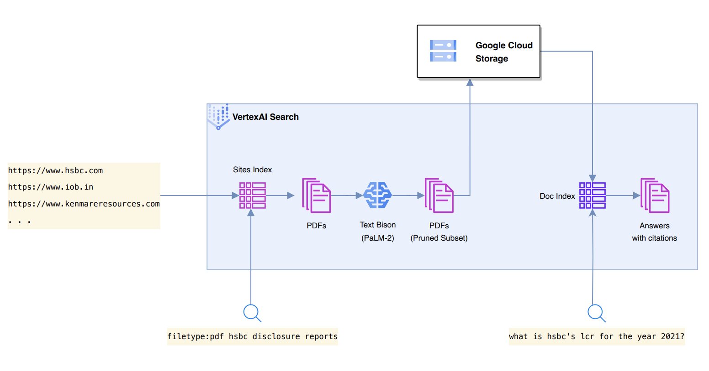
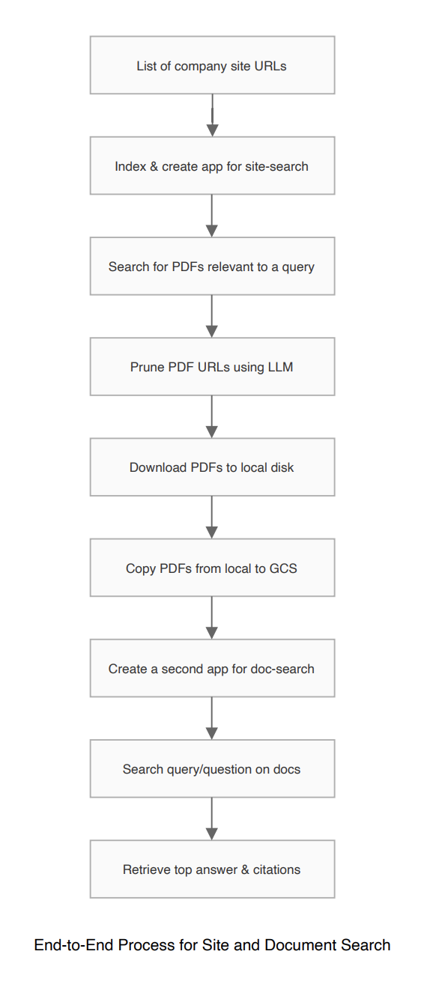

# VertexAIDocExplorer 🚀

Unlock the power of VertexAI Search with `VertexAIDocExplorer`, a two-tiered search pipeline designed to source and search documents intelligently. Source PDF documents from URLs and perform question-answering on indexed documents using Google's state-of-the-art PaLM-2 model.

<div align="center">

</div>


## 🌟 Features

- 🌐 **URL Indexing:** Index and search for links leading to PDF documents from a list of company website URLs.
- 🧠 **LLM Pruning:** Classify URLs into five categories using VertexAI search metadata and the PaLM-2 model.
- ⚡ **Async Downloader:** Download PDF documents asynchronously.
- ☁️ **Cloud Storage Uploader:** Upload documents to Google Cloud Storage seamlessly.
- 📖 **Document Indexing:** Index relevant PDFs for efficient searching.
- ❓ **Question Answering:** Enable question-answering capabilities on the indexed documents.

<div align="center">

</div>

## 🚀 Getting Started

### 🛠️ Prerequisites

- Python 3.8+ (3.9+ recommended).
- Recommended IDE: Visual Studio Code (but any IDE will work).

### 📥 Installation

1. **Clone** the repository:
```bash
git clone https://github.com/arunpshankar/VertexAIDocExplorer.git
```

2. **Navigate** to the project directory:
```bash
cd VertexAIDocExplorer
```

3. **Set Up Virtual Environment** (optional but recommended):
```bash
python3 -m venv .venv
source .venv/bin/activate
```

4. **Install Dependencies**:
```bash
pip install -r requirements.txt
```

5. **Update your PYTHONPATH**:
```bash
export PYTHONPATH=$PYTHONPATH:.
```

### 📘 Usage

Navigate to the `src/` directory to explore the source code. Begin with the `config` folder, which includes:

- `config.yml`: Configuration settings (e.g., GCP project ID, credentials).
- `doc-search-queries.jsonl`: Queries to evaluate document search results.
- `site-search-queries.jsonl`: Queries to evaluate site search results.
- `topics.jsonl`: Metadata for classifying PDF URL links.
- `sites.jsonl`: List of sites to index with VertexAI search.

The `run/` directory houses scripts for testing and evaluation:

- `site_search.py`: Finds PDFs across indexed sites.
```bash
python src/run/site_search.py
```

- `pruner.py`: Prunes site search results by classification.
```bash
python src/run/pruner.py
```

- `downloader.py`: Downloads PDFs from pruned URL links.
```bash
python src/run/downloader.py
```

- `uploader.py`: Uploads PDFs to Google Cloud Storage.
```bash
python src/run/uploader.py
```

- `doc_search.py`: Searches documents, returning relevant passages and answers.
```bash
python src/run/doc_search.py
```

- `evaluate.py`: Evaluates the explorer for site and document searches.
```bash
python src/run/evaluate.py
```

- `generate_reports.py`: Converts evaluation results to Excel sheets.
```bash
python src/run/generate_reports.py
```

🔍 **Note:** Prior to site searching, create a search app and data store using the site list. Before document searching, set up a search app pointing to the GCS bucket containing the PDFs from `downloader.py`.

## Sample Outputs

### Site Search Result:

```json
{
   "query": "filetype:pdf hsbc",
   "rank": 3,
   "title": "230710-hsbc-human-rights-statement.pdf",
   "link": "https://www.hsbc.com/-/files/hsbc/who-we-are/pdf/230710-hsbc-human-rights-statement.pdf",
   "snippet": "Jul 10 2023 ... HSBC is one of the world's largest banking and financial services organisations. Our global businesses serve more.",
   "metatags_title": "HSBC Human Rights Statement",
   "subject": "Annual Results 2021",
   "creationdate": "D:20230712180026+08'00'"
}
```

**Fields:**

- **query:** The user's search query.
- **rank:** The document's ranking in search results.
- **title:** Document title.
- **link:** URL to the document.
- **snippet:** A brief excerpt from the document.
- **metatags_title:** The title from the document's metatags.
- **subject:** The document's subject.
- **creationdate:** The document's creation date.

### Pruned Site Search Result:

```json
{
   "query": "Annual Registration Document of Standard Chartered for 2022 filetype: pdf",
   "rank": 10,
   "title": "Notice of 2019 Annual General Meeting - Announcement made to ...",
   "snippet": "Mar 6 2019 ... The Board of Directors of HSBC Holdings plc as at the date of this document comprises: Mark Tucker* John. Flint Kathleen Casey† Laura Cha† ...",
   "metatags_title": "Notice of 2019 Annual General Meeting - Announcement made to the HK stock exchange - English",
   "subject": "Stock exchange announcement",
   "creationdate": "D:20190225205638Z",
   "classification": "Annual Report",
   "rationale": "The document, titled 'Notice of 2019 Annual General Meeting,' contains information about the Board of Directors, suggesting it's an Annual Registration Document.",
   "link": "https://www.hsbc.com/-/files/hsbc/investors/results-and-announcements/stock-exchange-announcements/2019/march/sea-190306-e-2019-agm-circular.pdf"
}
```

**Fields:** 

Similar to the Site Search Result fields, with the addition of:

- **classification:** The category of the document.
- **rationale:** Reasoning behind the document's classification.

### Document Search Result:

```json
{
   "question": "Does the company have a Human Rights policy or a commitment to promote and respect human rights, and to prevent human rights violations or indigenous rights?",
   "rank": 6,
   "document": "gs://financial-pdf-documents/HSBC Supplier Code of Conduct  English.pdf",
   "segments": [
      {
         "segment": "¡ Not employ children, prohibit the use of child labour in their operations and supply chain, and take immediate and effective measures to stop child labour as a matter of urgency.",
         "page": "5"
      }
   ],
   "answer": "HSBC has commitments and rules in place to mitigate risks and prevent serious infringements of human rights and fundamental freedoms [5]. They also have policies to protect the environment and safeguard the health and safety of individuals [5]."
}
```

**Fields:**

- **question:** The query posed by the user.
- **rank:** The rank of the document in search results.
- **document:** The GCS path to the relevant PDF document.
- **segments:** List of relevant segments from the document.
  - **segment:** A text snippet from the document that's relevant to the query.
  - **page:** The page number where the segment can be found.
- **answer:** A concise answer to the query.

---

## Getting Started with Evaluation

In the `config` directory of the project repository, you will find the following JSONL files containing query examples for evaluation:

- `doc-search-queries.jsonl`: Contains queries related to document search.
- `site-search-queries.jsonl`: Contains queries related to site search.

Feel free to augment these files with additional queries as necessary.

## Running the Evaluation

To initiate the evaluation process:

1. Finalize the JSONL files with your queries.
2. Navigate to `src/run/evaluate.py` to execute the search against both site and document datasets.
3. Results will be saved in `data/evaluate/site-search-results.jsonl` and `doc-search-results.jsonl`.

## Generating Reports

After running the evaluation:

1. Run `src/run/generate-reports.py` to convert the JSONL results into Excel format.
2. The spreadsheets will be saved alongside the JSONL files with a `.xlsx` extension.

## Labeling the Results

With the Excel files ready:

1. Add a new column titled 'HUMAN LABEL' to both spreadsheets.
2. Begin labeling the site search and doc search results for relevance.

## Evaluation Criteria

For site-search results:

- Check if the URLs match the specified company and topic for a given query.

For doc-search results:

- Evaluate if the search results match relevant document segments and provide appropriate abstractive answers.

## Metrics for Evaluation

We employ several metrics to quantify the evaluation:

- **Precision (p)**
- **Precision at k (p@k)** (with k being 1, 3, and 5)
- **Mean Reciprocal Rank (mrr)**
- **Normalized Discounted Cumulative Gain (ndcg)** (including ndcg@3 and ndcg@5)

To calculate these metrics, utilize `src/metrics/site-search.py` and `src/metrics/doc-search.py`. These scripts will compute the scores based on the labeled Excel files.

## Results

The final evaluation metrics will be stored in:

- `data/metrics/site-search-evaluation-by-metrics.csv`
- `doc-search-evaluation-by-metrics.csv`

These files will help you understand the quality of the search results across various queries.

## Appendix

- [Creating a Datastore and Ingesting Data](https://cloud.google.com/generative-ai-app-builder/docs/create-datastore-ingest)
- [Preview Search Results](https://cloud.google.com/generative-ai-app-builder/docs/preview-search-results)